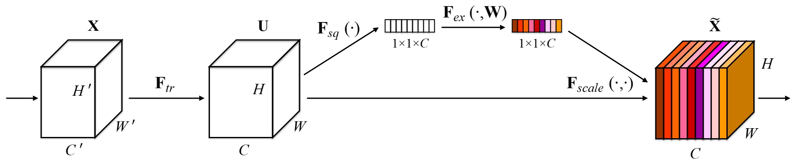
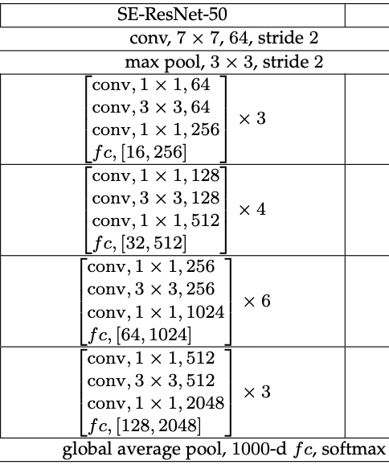
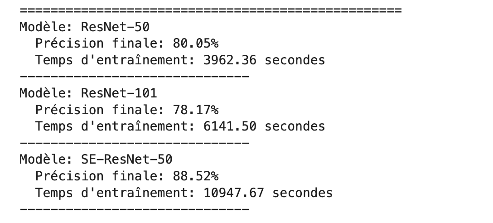

# Squeeze Excitation Network applied into ResNet-50

## Summary
-   [Architectures](#architectures)

    -   [SE Block](#squeeze-excitation-block-architecture)
    -   [SE Resnet 50](#se-resnet-50)
-   [Experimentations](#training-models-and-results)
    -   [Datasets and Models](#datasets-and-models)
    -   [Hyperparameters](#hyperparameters)
    -   [Results](#results)

In this Project we try to reexperiment the [Squeeze And Excitation Paper](https://arxiv.org/abs/1709.01507)

The presentation of this paper is there [Squeeze and Excitation Presentation](presentations/squeeze%20and%20excitation%20v2.pdf)

The aim is to build Se-Resnet-50 from scratch and train it using CIFAR-10 (100) datasets. 
We will compare the accuracy of the model to the classical Resnet-50 and Resnet-101 to evaluate the performance of the model in term of Accuracy and Execution

## Architectures

### Squeeze Excitation Block Architecture

This image is Squeeze Excitation Block. After Applying a convolution to an input channel resulting to an ouput channel. We will do some operations in those channels to verify which is has more impact using the squeeze and excitation operations. The results of this one will be element wise multiply to the output channel. 

<!-- ## Se-Resnet-50 Architecture -->

### SE-Resnet-50

To verify the effectiveness of the Squeeze Excitation Block, we implement an network named SE-Resnet-50 which use SE-Block as an residual network in Resnet-50. This is the Architecture of the model.

    

## Training Models and Results

### Datasets and Models

For the Processing we train differents models using CIFAR-10 and CIFAR-100. 

CIFAR-10  is an established computer-vision dataset used for object recognition. It is a subset of the 80 million tiny images dataset and consists of 60,000 32x32 color images containing one of 10 object classes, with 6000 images per class. 
<!-- It was collected by Alex Krizhevsky, Vinod Nair, and Geoffrey Hinton. -->

The CIFAR-100 dataset as the same as CIFAR-10 consists of 60000 32x32 colour images in 100 classes, with 600 images per class. The 100 classes in the CIFAR-100 are grouped into 20 superclasses. Each image comes with a "fine" label (the class to which it belongs) and a "coarse" label (the superclass to which it belongs). 

There are 50000 training images and 10000 test images in those 2 Datasets

For this experimentation we consider principally three models:
*   [Se-resnet-50](models/senet50.py) building from scracth
*   Resnet-50 imported without pretrained weight
*   Resnet-101 imported without pretrained weight.

### Hyperparameters

We train our model with training datasets (50k) and evaluate it using the test one (10k)

We run those different with:

*   Device : GPU (kaggle) - MPS (MAC)
*   Epochs: 100 Epochs
*   Optimizer : SGD - Momentum = 0.9 - Regularization = 5e-4 
*   Initial Learning Rate = 0.1 
*   Decreasing step size to epochs [30, 60, 90] - Gamma = 0.1
*   Criterion: CrossEntropyLoss

### Results

<table>
    <tr align="center">
        <td>CIFAR-10</td>
        <td>CIFAR-100</td>
    </tr>
    <tr>
        <td></td>
        <td></td>
    </tr>
</table>

*   Others Results
...
